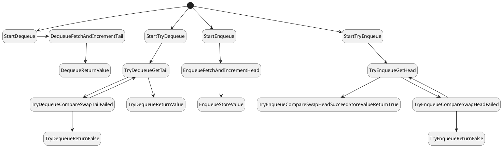
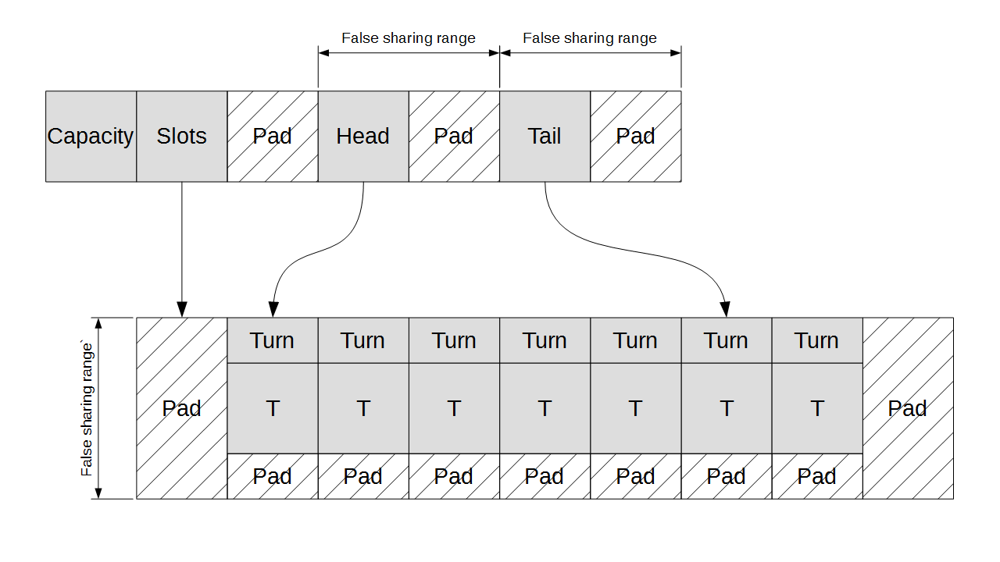

## Decisions

head and tail are atomic, so can be changed in one step

Relaxed only enforces order on a single atomic. Could be simulated as consumer thread accessing multiple atomics in any order, writer changing atomics separately

Release-Acquire Ordering is used to access slots. What does this mean?

all memory operations that happen in one thread will be seen in order to another thread doing the acquire

Load-Acquire imposes order on store-releasse

https://levelup.gitconnected.com/memory-model-basic-d8b5f8fddd5f

Emplace
Consistent order
head

Release/Acquire order
slot.turn

Try emplace
head compare_exchange_strong

Read/ Acquire
head initial
slot.turn

Pop

Strong
tail

Release / Acquire
slot.turn

Try Pop
Strong
tail

Release / Acquire
slot.turn
tail initial

Memory access for head / tail consistent across pop and push operations

Memory access forced consistent inside slots between push and pop

Memory access not forced consistent between different slots

There will be a strict ordering for how each slot is modified / read so simply having them occur in different orders is sufficent

Model mimics implementation closely. Not worried about bad memory placement. 